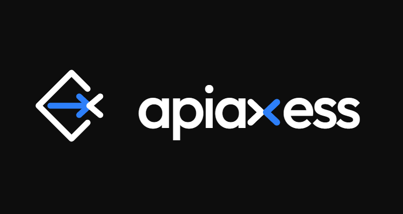
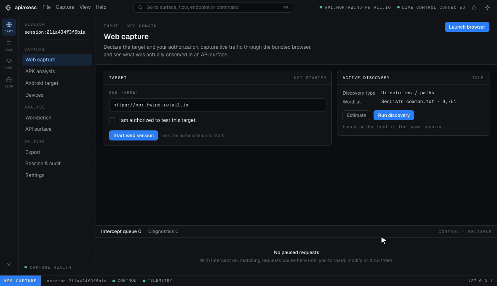
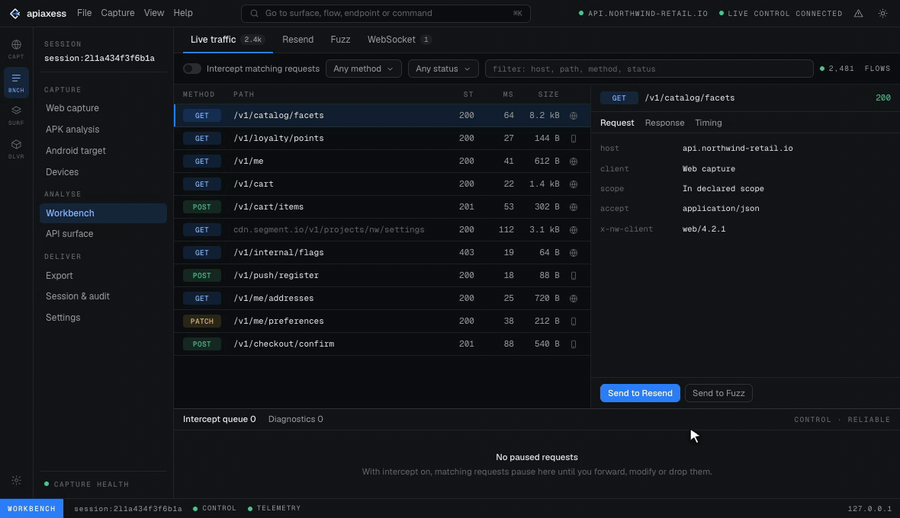
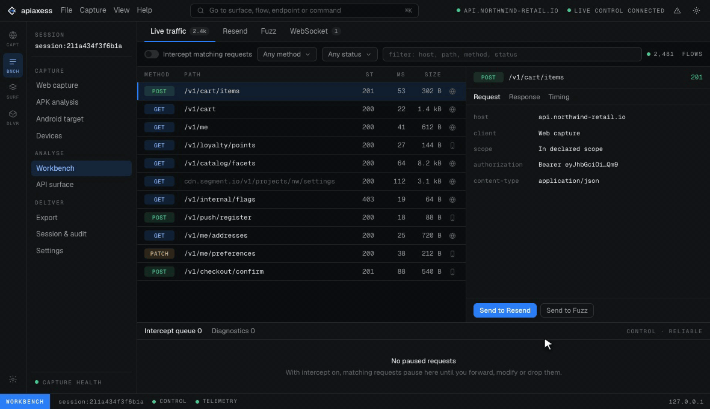
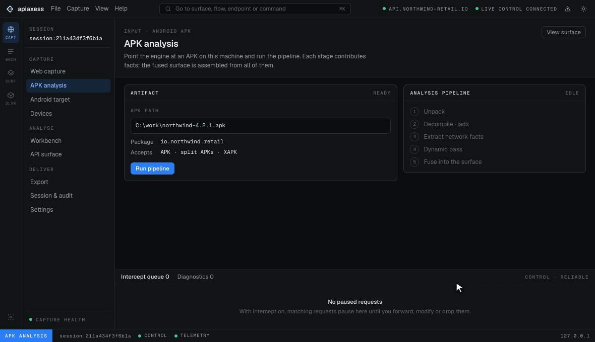

<p align="center">
  
</p>

<p align="center"><b>See what an app actually talks to.</b></p>

APIaxess points at a web app or an Android APK and recovers its real, reachable API surface, from the
traffic it makes and the code it ships. Then you can resend, fuzz, and export it. Zero setup, everything
bundled, and it all runs on your own machine.

<p align="center">
  <a href="https://apiaxess.dev">Website</a> ·
  <a href="#install">Download</a> ·
  <a href="LICENSE">License</a> ·
  <a href="SECURITY.md">Security</a>
</p>

## The problem

Mapping an app's API is mostly setup. You stand up a proxy, install a CA, fight cert pinning, decompile
the APK by hand, spin up an emulator, and glue a pile of tools together. After all that you still can't
be sure you've seen everything the app hits.

## What it does

Give it a target. It captures and analyzes, then hands you one honest API surface. Every endpoint is
labeled by evidence (confirmed vs. inferred) and first or third party, and the coverage it couldn't
confirm is shown plainly instead of guessed at.

- **Web.** A bundled browser through a MITM proxy. HTTP/1.1 and 2, WebSocket, SSE, gRPC-Web, GraphQL.
- **Android.** Unpack and decompile statically, drive the app in a bundled emulator, capture the live
  traffic, and fuse both into one surface.
- **Work it.** Resend (Repeater, cleaner), Fuzz (Burp-Intruder class), Intercept.
- **Export.** OpenAPI 3.1, Postman, HAR, and a runnable Python (httpx) SDK.

Everything it needs is bundled: Chromium, a Java runtime, apktool, jadx, ffuf, Frida, an Android emulator.
Nothing to install and wire up. It all runs on `127.0.0.1`, and the only thing it ever sends out is an
optional update check you can turn off.

## Demo

**Web capture into an API surface.** Point it at a web app, browse, and watch the surface build itself
from what actually gets hit.

<p align="center"></p>

**Fuzz.** Burp-Intruder-class attacks over the endpoints you just recovered.

<p align="center"></p>

**Resend.** Replay and tweak any request. Repeater, but cleaner.

<p align="center"></p>

**APK analysis.** Pull the static API surface straight out of an Android app.

<p align="center"></p>

## Install

Windows and Linux today, macOS is on the way. Builds are unsigned for now, so verify the published
SHA-256 checksums. On Windows the first run shows SmartScreen's "unknown publisher, Run anyway".

**Windows**

```bash
scoop bucket add apiaxess https://github.com/KatrielMoses/scoop-apiaxess
scoop install apiaxess/apiaxess
```

Or `choco install apiaxess`, or grab the MSI from [apiaxess.dev](https://apiaxess.dev).

**Linux (Debian/Ubuntu)**

```bash
sudo apt install ./apiaxess_*.deb
```

Downloads and checksums live at [apiaxess.dev](https://apiaxess.dev) and on the
[releases page](https://github.com/KatrielMoses/apiaxess/releases/latest). The app updates itself, which
is optional and identifier-free, and you can turn it off in Settings.

## Build from source

Rust 1.88+, Node 22+, pnpm 11+.

```bash
pnpm install --frozen-lockfile
pnpm ui:build
cargo run -p apiaxess
```

Then open `http://127.0.0.1:7777`. Start with [architecture.md](architecture.md) and
[docs/architecture/](docs/architecture/) for the lay of the land.

## Where things live

- `apps/` is the engine (`apps/engine`), the desktop shell (`apps/desktop`), the GUI (`apps/gui`), and
  the Android client.
- `crates/` is the Rust engine: proxy, analysis pipeline, workbenches, exporters.
- `plugins/` is target support (APK).
- `packaging/` is the MSI, `.deb`, Scoop, and Chocolatey.

## Honest by design

Local-first. The engine, capture proxy, and session store all run on loopback. No telemetry, no
analytics, no license calls. Just one optional, identifier-free update check (a plain GET of a static
file on apiaxess.dev, served via Cloudflare like any website) that you can switch off. Scope is advisory:
it records and warns, and it never silently authorizes more than you told it to.

## Contributing and security

PRs welcome, see [CONTRIBUTING.md](CONTRIBUTING.md). Found a vulnerability? Please report it privately via
[SECURITY.md](SECURITY.md). Licensed under [Apache-2.0](LICENSE).
